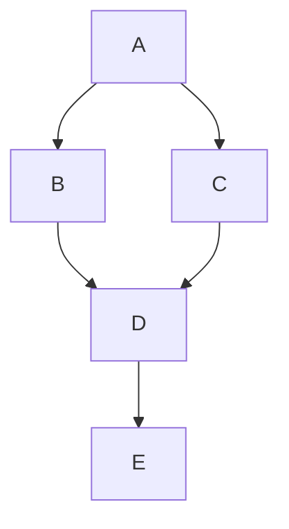
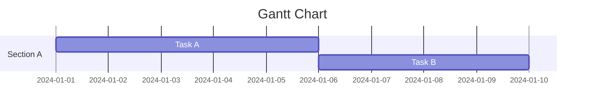
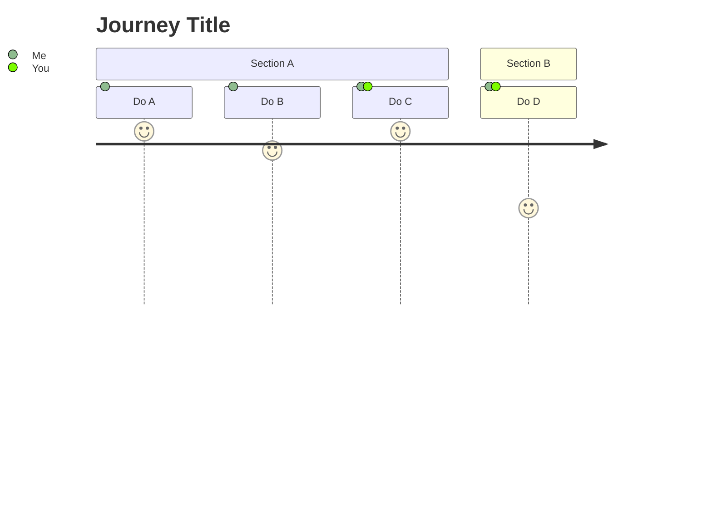

# Additional Plugins

## Mermaid

This section describes some of [`mermaid`](https://mermaid.js.org/) plugin usage.

### Graph

````md {1} showLineNumbers

````



### Gantt Chart

````md showLineNumbers

````


### User Journey

````md showLineNumbers

````


## KaTeX

```md show showLineNumbers
Let $f\colon[a,b]\to\R$ be Riemann integrable. Let $F\colon[a,b]\to\R$ be
$F(x)=\int_{a}^{x} f(t)\,dt$. Then $F$ is continuous, and at all $x$ such that
$f$ is continuous at $x$, $F$ is differentiable at $x$ with $F'(x)=f(x)$.

$$
I = \int_0^{2\pi} \sin(x)\,dx
$$
```

Let $f\colon[a,b]\to\R$ be Riemann integrable. Let $F\colon[a,b]\to\R$ be
$F(x)=\int_{a}^{x} f(t)\,dt$. Then $F$ is continuous, and at all $x$ such that
$f$ is continuous at $x$, $F$ is differentiable at $x$ with $F'(x)=f(x)$.

$$
I = \int_0^{2\pi} \sin(x)\,dx
$$
